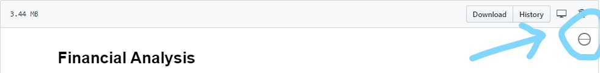

# Finance with Python

## Financial Analysis

### The visualizations are interactive, make sure to use a **nbviewer** !
https://nbviewer.jupyter.org/github/BrahimMebrek/Finance_Python/blob/c555842bc91598878c2cdff25eb8a3d40092e190/Financial_Analysis.ipynb

Or

This notebook contains :
- An automation of the financial data gathering process using the **Financial Modeling Prep API**.
- An Income Statement analysis of **IBM**, with visiualizations using **Plotly**.

### Ressources
- Financial Modeling Prep API Documentation : https://financialmodelingprep.com/developer/docs/ 
- Plotly financial charts : https://plotly.com/python/financial-charts/
- IBM financial analysis : https://www.researchgate.net/publication/309533206_Financial_Analysis_of_IBM
- Financial Definitions : 
    - https://www.investopedia.com/
    - https://en.wikipedia.org/wiki/Ticker_symbol

- The main Resources :   
    - https://www.thebalance.com/investing-lesson-4-income-statement-analysis-357580
    - https://www.accountingtools.com/articles/income-statement-analysis.html
    - https://codingandfun.com/

## Stock Market

### 1 / Basic Stock Data Manipulation
### The visualizations are interactive, make sure to use a **nbviewer** ! 
https://nbviewer.jupyter.org/github/BrahimMebrek/Finance_Python/blob/e878f4b5e9f7c62845aaef56d05a43f6ed1e4431/Stock_Market/Basic_Stock_Data_Manipulation.ipynb   
This notebook is the first part of our Stock Data Manipulation Study. It contains:
- Some key financial definitions.
- Stock Market data gathering using the **Yahoo! Financial API**.
- Visualizations of the gathered data using **Plotly**.
- Some basic manipulation techniques (Moving Average, Resampling and Portfolio creation)

### 2 / Stock Data Gathering and Preparation
This notebook contains an automation of the data gathering process by :
- Scrapping the tickers symbols of the **S&P 500 index** companies.
- Gathering the Stock prices of these companies using the **Yahoo! Finance API**.
- Merging the Adjacent Closing Price of each companie into one dataset.

### Resources
- List of the S&P 500 companies : https://en.wikipedia.org/wiki/List_of_S%26P_500_companies
- How to download stock prices in Python : https://www.codingfinance.com/post/2018-03-27-download-price-py/
- How to calculate stock returns in Python : https://www.codingfinance.com/post/2018-04-03-calc-returns-py/
- Computer Science YouTube video Python for Finance : https://www.youtube.com/watch?v=O-O1WclwXck
- Financial Python : https://www.quantconnect.com/tutorials/introduction-to-financial-python/rate-of-return,-mean-and-variance
- Yahoo Finance API to get Stocks tickers data in python : https://medium.com/@jouneidraza522/yahoo-finance-api-to-get-stocks-tickers-data-in-python-c49820249a18

- The main resource:
    - Most of the methodes and techniques used in the study are from the excellent - Sentdex YouTube Playlist, Python Programming for Finance : https://www.youtube.com/playlist?list=PLQVvvaa0QuDcOdF96TBtRtuQksErCEBYZ

#### Created By MEBREK Brahim
